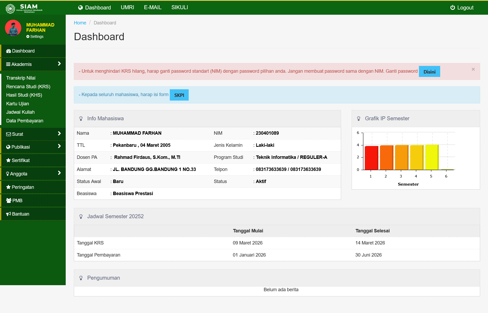

# 🎓 SIAM UMRI Redesign

Modern, clean, and responsive redesign of the Sistem Informasi Akademik Mahasiswa (SIAM) for Universitas Muhammadiyah Riau (UMRI). Built with a focus on user experience, performance, and modern aesthetics.



## ✨ Features

- **📊 Dynamic Dashboard**: Real-time overview of student academic status.
- **📈 IPK Visualization**: Interactive charts for GPA tracking using Recharts.
- **📅 Smart Schedule**: Daily lecture schedule with "Ongoing" and "Upcoming" indicators.
- **⚡ Quick Access**: Fast shortcuts for KRS online, transcript downloads, and UKT payments.
- **📱 Fully Responsive**: Optimized for desktop, tablet, and mobile devices.
- **📄 Academic Management**:
  - Kartu Rencana Studi (KRS)
  - Kartu Hasil Studi (KHS)
  - Transkrip Nilai
  - Jadwal Perkuliahan
  - Riwayat Pembayaran
  - Pengajuan Surat Mahasiswa

## 🚀 Tech Stack

- **Framework**: [React 19](https://react.dev/)
- **Build Tool**: [Vite 8](https://vitejs.dev/)
- **Styling**: [Tailwind CSS 4](https://tailwindcss.com/)
- **Animations**: [Framer Motion 12](https://www.framer.com/motion/)
- **Icons**: [Lucide React](https://lucide.dev/)
- **Charts**: [Recharts](https://recharts.org/)
- **Routing**: [React Router 7](https://reactrouter.com/)

## 🛠️ Development

### Prerequisites

- Node.js (Latest LTS recommended)
- npm or yarn

### Installation

1. Clone the repository:
   ```bash
   git clone https://github.com/mhdfrhan/siam-umri-redesign.git
   ```

2. Install dependencies:
   ```bash
   npm install
   # or
   yarn install
   ```

3. Run the development server:
   ```bash
   npm run dev
   # or
   yarn dev
   ```

## 📝 License

This project is created for educational and design exploration purposes.

---

Crafted with ❤️ by [mhdfrhan](https://github.com/mhdfrhan)
